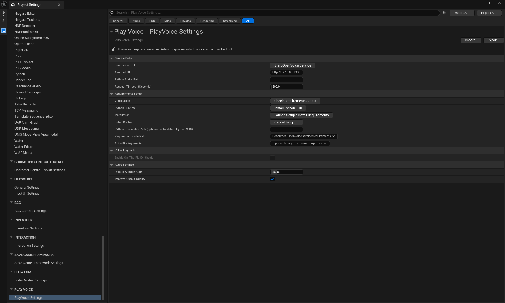
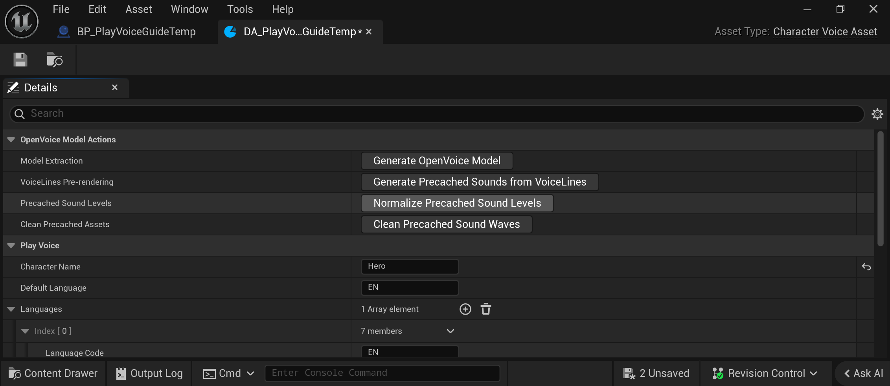
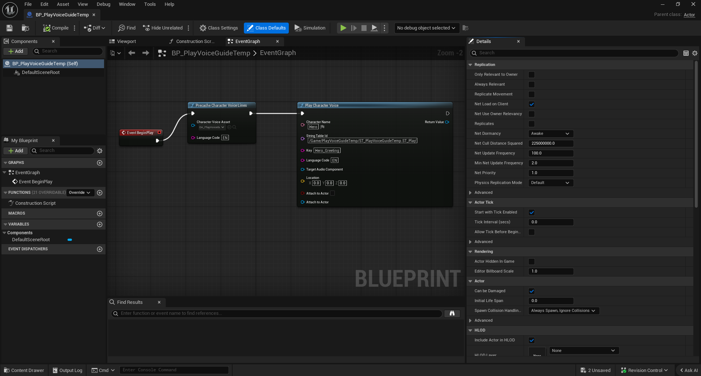

# PlayVoice CharacterVoiceAsset How-To

This guide shows the complete editor-time workflow for creating a `CharacterVoiceAsset`, extracting an OpenVoice-v2 model, rendering localized SoundWaves, and playing those cached lines in Blueprint.

> **Scope:** PlayVoice performs Python and HTTP work only while authoring in the Unreal Editor. Packaged builds play generated `USoundWave` assets and do not launch Python, call the local service, or synthesize missing lines.
>
> **Voice rights:** Use only reference recordings and voices for which you have the speaker's consent and the rights required for your project.

## Workflow at a glance

Complete these stages in order:

1. Install and verify Python 3.10 requirements.
2. Create a `CharacterVoiceAsset`.
3. Set the character identity and at least one language.
4. Add language reference recordings.
5. Click **Generate OpenVoice Model**.
6. Add String Table keys to **Voice Lines** and record or assign optional guide tracks.
7. Click **Generate Precached Sounds from VoiceLines**.
8. Optionally click **Normalize Precached Sound Levels**.
9. Use the cached line from Blueprint and package the generated SoundWaves.

Do not generate voice lines before the model is generated for the matching language. Regenerating a line replaces the generated package for that exact language and String Table key.

## Before you begin

### Unreal and plugin setup

1. Open the Unreal Engine 5.8 project containing PlayVoice.
2. Enable **PlayVoice Plugin** under **Edit > Plugins** if it is not already enabled.
3. Open **Project Settings > Project > PlayVoice Settings**.
4. Under **Requirements Setup**, use a Python **3.10.x** interpreter. Python 3.11 and newer are not supported by the current OpenVoice dependency pins.
5. Leave **Python Executable Path** empty for Windows `py.exe -3.10` discovery, or select a Python 3.10 executable explicitly.
6. Click **Check Requirements Status**.
7. Click **Launch Setup / Install Requirements**. The plugin creates or reuses `Resources/OpenVoiceService/.venv` and installs the requirements there.
8. Confirm that the service URL is `http://127.0.0.1:1983`, unless your project uses another local port.

**Improve Output Quality** is enabled by default. When enabled, generated output is resampled to **Default Sample Rate**, which is 48 kHz by default. OpenVoice reference processing, embeddings, guide conversion, and inference remain at native 24 kHz. When disabled, generated output remains at 24 kHz.

### Settings and service controls

Open **Edit > Project Settings**, search for **PlayVoice**, and select the project-level PlayVoice category. The expected settings are:

| Category | Setting or button | Purpose |
| --- | --- | --- |
| **Service Setup** | **Service URL** | Local REST endpoint, normally `http://127.0.0.1:1983`. |
| **Service Setup** | **Python Script Path** | Optional path to `openvoice_service.py`; the plugin resolves its default resource path when empty. |
| **Service Setup** | **Request Timeout (Seconds)** | Maximum request/setup wait time. Keep this high enough for model extraction and rendering. |
| **Service Setup** | **Start OpenVoice Service** | Starts the editor-owned local FastAPI/Uvicorn process. |
| **Requirements Setup** | **Python Executable Path** | Optional Python 3.10 executable. Empty uses Windows `py.exe -3.10` discovery. |
| **Requirements Setup** | **Requirements File Path** | Defaults to `Resources/OpenVoiceService/requirements.txt`. |
| **Requirements Setup** | **Extra Pip Arguments** | Optional flags such as `--upgrade` or `--no-cache-dir`. |
| **Requirements Setup** | **Check Requirements Status** | Verifies the configured interpreter and required packages. |
| **Requirements Setup** | **Install Python 3.10** | Opens the official Python 3.10.11 Windows installer download. Run the installer before continuing. |
| **Requirements Setup** | **Launch Setup / Install Requirements** | Creates or reuses `.venv`, verifies Python 3.10, and installs the requirements. |
| **Requirements Setup** | **Cancel Setup** | Stops an active dependency installation. |
| **Audio Settings** | **Default Sample Rate** | Final generated SoundWave rate when output-quality improvement is enabled. |
| **Audio Settings** | **Improve Output Quality** | Resamples final output to the configured sample rate; inference remains at 24 kHz. |

Use this order for a new machine:

1. Install Python 3.10 if needed.
2. Set or verify **Python Executable Path**.
3. Click **Check Requirements Status**.
4. Click **Launch Setup / Install Requirements**.
5. Click **Start OpenVoice Service**, or let model extraction start it on demand.
6. Wait for the service health check to report readiness before generating a model.



*This live capture was taken after rebuilding and relaunching the editor. The **Play Voice - PlayVoice Settings** category is visible under the **Play Voice** section. The capture verifies the default service URL, 300-second request timeout, Python 3.10 auto-detection field, requirements path, pip arguments, setup buttons, 48 kHz output rate, and enabled output-quality improvement.*

## Create the asset

1. Open the **Content Browser**.
2. Right-click in the destination folder.
3. Choose **Miscellaneous > Data Asset**.
4. Select **CharacterVoiceAsset**.
5. Name the asset with a clear project convention, such as `DA_HeroVoice`.
6. Open the new asset to display its Details panel.

## Configure the asset

### Character identity

| Parameter | What to enter | Example |
| --- | --- | --- |
| **Character Name** | A stable unique identifier used by Blueprint lookup. | `Hero` |
| **Default Language** | The language used when a Blueprint request does not specify one. | `EN` |
| **Languages** | One entry for every language that will have a model and generated lines. | `EN`, `FR` |

Use short, normalized language codes consistently. The plugin indexes language-specific models and cached SoundWaves by these codes.

### Language parameters

Each entry in **Languages** contains the following fields:

| Parameter | Editable? | Purpose |
| --- | --- | --- |
| **Language Code** | Yes | Identifies the language, such as `EN` or `FR`. |
| **Reference Audio Files** | Yes | Individual WAV, MP3, or FLAC recordings that provide the speaker's tone color. |
| **Reference Audio Folder** | Yes | A project folder containing reference recordings for the language. |
| **Speed** | Yes | Speech speed multiplier from `0.5` to `2.0`; `1.0` is the default. |
| **Tone Color Embedding Data** | No | OpenVoice-v2 embedding generated from the reference recordings. |
| **Model Checkpoint Path** | No | Project-local JSON embedding path persisted by model extraction. |
| **Is Model Generated** | No | Indicates that a valid model embedding exists for the language. |

Use clean, non-empty recordings from the intended speaker. A language must have reference audio before model extraction can succeed. Files may be supplied individually, through a folder, or through both fields.



*This live capture shows the temporary `DA_PlayVoiceGuideTemp` asset with `Hero`, `EN`, one language entry, one String Table line, and the OpenVoice action category. The temporary asset was deleted after capture.*

### Voice line parameters

Add one **Voice Lines** entry for each localized line you want to pre-render.

| Parameter | Editable? | Purpose |
| --- | --- | --- |
| **String Table** | Yes | String Table containing the dialogue text. |
| **String Table ID** | No | Persisted identifier used for exact lookup after reload or cooking. |
| **Key** | Yes | String Table key for the line. |
| **Text Line** | No | Text resolved automatically from the String Table and key. |
| **Audio File** | Yes | Optional WAV, MP3, or FLAC guide track for cadence, timing, and delivery. |
| **Guide Sound Wave** | Yes | Optional imported `USoundWave` used as the guide source. |
| **Precached Sound Wave** | Generated | Legacy default-language cache reference retained for migration. |
| **Precached Sound Waves by Language** | Generated | Language-specific generated SoundWave references. |

A guide track supplies the source speech signal for prosody and emotion transfer. The `emotion` metadata field does not interpret arbitrary emotion labels by itself. If no guide track is supplied, OpenVoice generates from the text and speaker embedding without that recorded delivery reference.

## Generate the voice model

1. In the asset Details panel, verify every language has a language code and reference audio.
2. Open **OpenVoice Model Actions**.
3. Click **Generate OpenVoice Model**.
4. Wait for the service health check, extraction, and asset save to complete.
5. Confirm that **Tone Color Embedding Data** is populated and **Is Model Generated** is enabled for each language.

The button extracts a real OpenVoice-v2 tone-color embedding. It does not create a generic fallback model. If extraction fails, check the configured Python interpreter, service health, reference paths, and service logs before continuing.

## Add a String Table line

For the example below, create a String Table with ID `ST_Dialogue` and add this entry:

| Key | Source text |
| --- | --- |
| `Hero_Greeting` | `Welcome back, traveler.` |

Then configure the asset:

1. Add an entry to **Voice Lines**.
2. Assign `ST_Dialogue` to **String Table**.
3. Set **Key** to `Hero_Greeting`.
4. Confirm that **Text Line** resolves to `Welcome back, traveler.`.
5. Optionally record a guide track and assign it to **Audio File** or **Guide Sound Wave**.
6. Save the asset.

## Generate precached SoundWaves

1. Confirm that the model is generated for every language you intend to render.
2. Confirm that every Voice Lines entry has a valid String Table and key.
3. Open **OpenVoice Model Actions**.
4. Click **Generate Precached Sounds from VoiceLines**.
5. Wait for every `(language, key)` task to finish.
6. Save or reload the asset and verify the language-specific cache references.

The plugin creates one generated SoundWave package for each language and String Table key. Re-running generation removes the prior matching generated package before creating its replacement. The generated SoundWave and updated `CharacterVoiceAsset` references are both saved.

### Optional level normalization

Click **Normalize Precached Sound Levels** after generation when the lines need consistent loudness. The action scales all non-silent cached SoundWaves in this asset to the loudest non-silent wave and saves the modified packages.

### Cleaning generated output

Click **Clean Precached Sound Waves** when you intentionally want to remove generated output before rebuilding or deleting the workflow. The action clears cache references and deletes the generated SoundWave packages. It does not remove your source recordings, String Table, or model reference audio.

## Complete example

The following is a minimal English setup:

```text
Asset:           DA_HeroVoice
Character Name:  Hero
Default Language: EN

Languages[0]
  Language Code: EN
  Reference Audio Files: Audio/Voice/Hero/reference_01.wav
  Speed: 1.0
  Is Model Generated: true

Voice Lines[0]
  String Table: ST_Dialogue
  Key: Hero_Greeting
  Text Line: Welcome back, traveler.
  Audio File: Audio/Voice/Hero/greeting_guide.wav
  Precached Sound Waves by Language
    EN: DA_HeroVoice_HeroGreeting_EN
```

The correct order for this example is:

```text
Create asset
  -> configure EN reference audio
  -> Generate OpenVoice Model
  -> add ST_Dialogue / Hero_Greeting
  -> assign optional greeting_guide.wav
  -> Generate Precached Sounds from VoiceLines
  -> optionally Normalize Precached Sound Levels
  -> use Play Character Voice in Blueprint
```

## Play a generated line in Blueprint

Use the generated cache rather than runtime synthesis:

1. Add **Get String Table ID and Key from Text** for the localized dialogue text.
2. Add **Play Character Voice**.
3. Connect **Character Name** to `Hero`.
4. Connect **String Table Id** and **Key** from the String Table lookup node.
5. Set **Language Code** to `EN`, or leave it empty to use the asset default language where supported.
6. Optionally provide an audio component or world location.

The node resolves the exact CharacterVoiceAsset, String Table ID, key, language, and cached SoundWave. It does not start Python or synthesize audio in a packaged build.

## Blueprint playback step by step

The plugin exposes two playback paths. Use the identifier path when your dialogue comes from a String Table, and use the asset/key path when the line is already represented by a `CharacterVoiceAsset` entry.

### Recommended String Table workflow

1. Finish model extraction and editor-time precaching before testing gameplay.
2. Open the Blueprint that owns the dialogue trigger.
3. In the Event Graph, add **Event BeginPlay**, an interaction event, or another event that should start the line.
4. Add **Precache Character Voice Lines** when you want the Blueprint to ensure the configured cache is available before playback. Set **Character Voice Asset** to the asset and **Language Code** to `EN`. This node does not synthesize missing lines in a packaged build.
5. Add **Play Character Voice** from the **PlayVoice** category.
6. Set **Character Name** to the asset's `Character Name`, such as `Hero`.
7. Use **Get String Table ID and Key from Text** on the localized `FText`, then connect its String Table ID output to **String Table Id** and its Key output to **Key**. For a fixed line, set **String Table Id** to the exact table identifier and **Key** to `Hero_Greeting`.
8. Set **Language Code** to `EN`, or leave it empty to use the asset default language where supported.
9. Optionally connect **Target Audio Component**, **Location**, **Attach to Actor**, and **Attach To Actor** when the line needs a specific playback target.
10. Connect execution pins, compile the Blueprint, and test the event.

The node resolves the matching `CharacterVoiceAsset` by `Character Name`, then looks up the exact String Table ID, key, and language-specific cached SoundWave. It returns an `Audio Component` that can be stored, stopped, or configured with normal Unreal audio controls.



*This live graph was created and compiled through Unreal MCP. It shows `Event BeginPlay` connected to `Precache Character Voice Lines`, followed by `Play Character Voice` with `Hero`, the temporary String Table identifier, `Hero_Greeting`, and `EN` configured. The temporary Blueprint and its assets were deleted after capture.*

### Alternative CharacterVoiceAsset key workflow

Use **Play Character Voice From Key** when you want the Blueprint node to receive the asset directly:

1. Add **Play Character Voice From Key** from the **PlayVoice** category.
2. Set **Character Voice Asset** to the `CharacterVoiceAsset`.
3. Set **Key** to a key represented in the asset's **Voice Lines** array.
4. Set **Language Code** to the generated language.
5. Connect the execution and optional audio-target pins.

This path uses the asset's String Table mapping and language-specific cache. It is convenient for a known asset and key, while **Play Character Voice** is preferable for runtime character lookup by identifiers.

### Other Blueprint nodes

| Node | Use |
| --- | --- |
| **Precache Character Voice Lines** | Checks or prepares authored lines for an asset and language. Generate missing audio in the editor first. |
| **Generate Voice Sound Wave** | Requests an asynchronous SoundWave generation callback during supported editor authoring workflows. Do not depend on it to synthesize in a packaged build. |
| **Is Character Voice Model Generated** | Checks whether the asset has a valid extracted model for a language before requesting authoring work. |
| **Play Character Voice From Key** | Plays an asset Voice Lines entry by key. |
| **Play Character Voice** | Plays an exact language-specific cache by Character Name, String Table ID, and key. |
| **Play Character Voice By Identifiers** | Subsystem variant for resolving the same Character Name, String Table ID, key, and language inputs from a world context. |

### Fixed example

For `DA_HeroVoice`, `ST_Dialogue`, key `Hero_Greeting`, and language `EN`, the graph is:

```text
Event BeginPlay
    -> Precache Character Voice Lines
       Character Voice Asset = DA_HeroVoice
       Language Code = EN
    -> Play Character Voice
       Character Name = Hero
       String Table Id = ST_Dialogue's exact table ID
       Key = Hero_Greeting
       Language Code = EN
```

Do not connect a localized display string directly to **Key**. Pass the String Table ID and key returned by the String Table lookup node, or set both values explicitly for a fixed entry.

## Troubleshooting checklist

| Symptom | Check |
| --- | --- |
| Model generation fails | Python is 3.10.x, requirements are installed, the service is healthy, and reference paths point to non-empty files. |
| No line is generated | The model exists for the requested language, the String Table and key are valid, and the Voice Lines entry resolves text. |
| Guide track is missing | Use a canonical absolute file path or a valid imported SoundWave. Do not rename or move the recording without updating the entry. |
| Blueprint cannot find a line | Match Character Name, String Table ID, key, and language exactly. Verify the generated SoundWave remains referenced. |
| Packaged build has no new voice | Generate and save all SoundWaves before packaging. Packaged builds cannot synthesize missing lines. |

## Visual note

The CharacterVoiceAsset, Project Settings, and Blueprint screenshots in this guide were captured after rebuilding and relaunching the Unreal Editor through Unreal MCP. The temporary CharacterVoiceAsset, String Table, and Blueprint used for the captures were deleted afterward.
